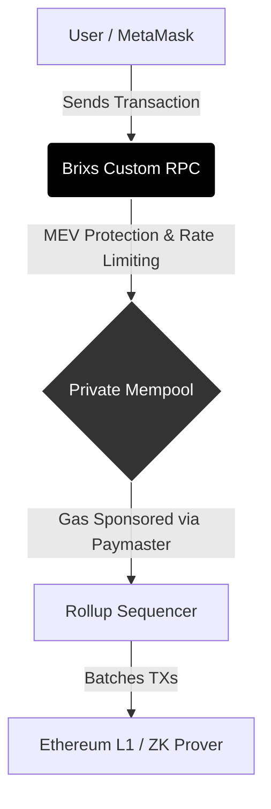
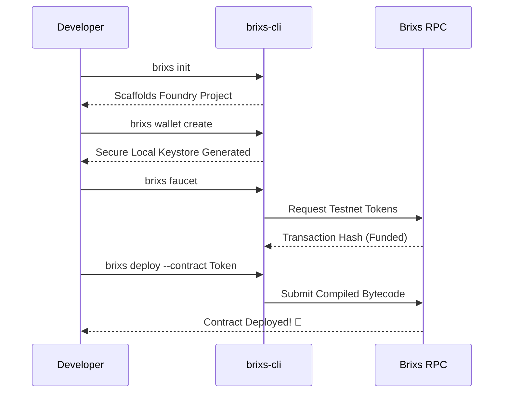

  
  <h1>Brixs Chain Infrastructure</h1>
  
The highly scalable, EVM-Equivalent, ZK-powered Layer 2 Ecosystem built for mass adoption.

  
  
  
  
  

   
  
<b>Supported Networks & Interoperability</b>

  
  
  
  
  

 

## ▣ Network Economics

The native `$BRIXS` token powers the entire ecosystem, acting as gas, staking collateral for validators, and governance weight.

## ▣ Ethereum L2 & Multi-Chain Interoperability

Brixs Chain is fundamentally designed as an **Ethereum Layer 2 (L2) Scaling Solution**, but with native multi-chain support built directly into the protocol:

*   **Ethereum Security (The Base Layer):** Brixs Chain settles all transactions on Ethereum Mainnet. By utilizing cryptographic Zero-Knowledge (ZK) proofs, Brixs batches thousands of transactions off-chain and submits a single cryptographic proof to Ethereum. This guarantees that Brixs Chain inherits the uncompromisable security of the Ethereum network while keeping gas fees near zero.
*   **Omnichain Liquidity (L2 to L2):** Through the `BrixsRouter` and underlying LayerZero/Hyperlane infrastructure, Brixs acts as a liquidity hub. Users and smart contracts on **Polygon, Arbitrum, Optimism, and Base** can seamlessly interact with applications on Brixs Chain *without* requiring users to manually bridge their tokens or switch RPC networks in their wallets.

## ▣ The Blockchain Trilemma: Problem vs. Brixs Solution

Modern blockchain networks face the "Blockchain Trilemma" — balancing Decentralization, Security, and Scalability. Traditional Layer 1s and legacy Layer 2s often sacrifice one for the other. Here is exactly how Brixs Chain resolves these critical infrastructure problems:

| Infrastructure Problem | Legacy / Traditional Setup | Brixs Chain Solution |
| :--- | :--- | :--- |
| **Execution & Smart Contracts** | Standard EVM processing (Sequential) | **100% EVM Equivalence + Parallel EVM**, processing transactions 10x faster without rewriting Solidity code. |
| **Consensus & Security** | Proof of Work or basic PoS | **BFT Consensus Layer** where validators stake $BRIXS. Malicious actors are slashed instantly. |
| **L1 to L2 Bridging** | Multi-sig bridges prone to hacks | **Trustless ZK-Bridge** using cryptographic Zero-Knowledge Prover networks. No human interception. |
| **Tokenomics & Fees** | High, unpredictable gas fees | **Native $BRIXS Gas Token** with EIP-1559. Deflationary design where base fees are burned to sustain network value. |
| **RPC node Latency** | Public endpoints crashing under load | **Enterprise RPC Load Balancing** globally distributed to ensure DApps and wallets never experience network lag. |
| **Developer Onboarding** | Fragmented tools and manual configs | **`brixs-cli` Ecosystem** for instant deploy, automated testnet funding, and built-in RPC configurations. |

---

## ▣ Core Architecture & Network Design

Brixs Chain is more than just a blockchain; it's a complete, vertically integrated stack designed to support the next billion users. 

### ◩ 1. Custom RPC & Router Infrastructure
A blockchain is only as good as its gateway. Instead of standard nodes, Brixs Chain uses a **Custom RPC Middleware Architecture**:
* **Built-in Analytics:** Tracks exactly how the chain is being utilized natively at the node level.
* **Gas Sponsorship (Paymaster API):** Intercepts transactions and natively pays gas for users using our EIP-4337 infrastructure.
* **MEV Protection:** Prevents malicious front-running by processing transactions in a private mempool before submitting them to the sequencer.
* **Enterprise Rate-Limiting:** Protects the network from DDoS attacks natively.

### ◩ 2. Native Smart Accounts (Web3 Smart Wallets)
Standard EVM chains rely on Externally Owned Accounts (EOAs), which require users to bridge assets and hold native gas tokens. Brixs natively integrates **Smart Contract Wallets**:
* **Social Login & Account Abstraction:** Users can log in with Google/Email seamlessly. 
* **Gasless Transactions:** Powered by Pimlico and our native Paymaster, users can interact with dApps without ever buying or bridging gas tokens.

### ◩ 3. Unified Liquidity & Routing
Our custom **BrixsRouter** smart contracts communicate via cross-chain messaging protocols (like LayerZero/Hyperlane) to allow users on Arbitrum, Optimism, or Polygon to interact with Brixs Chain natively without manual bridging.

---

## ▣ The Brixs Developer CLI (`brixs-cli`)

We built the `brixs-cli` for the community. The CLI removes all the friction of building, funding, and deploying smart contracts on the Brixs network. It is built using Node.js, Commander.js, and Ethers.js.

### Core Commands

* `brixs init`
Instantly scaffolds a new, production-ready Foundry or Hardhat project that is already pre-configured with Brixs Chain's custom RPCs, chain IDs, and testnet settings.

* `brixs wallet create`
Generates a local encrypted keystore for the developer securely on their machine, ensuring private keys are never exposed in plaintext configuration files.

* `brixs faucet <address>`
Automatically pings our custom backend to fund the developer's address with Testnet $BRIXS instantly right from the terminal. No more solving captchas on laggy website faucets.

* `brixs deploy --contract <Name>`
Compiles your Solidity code and deploys it directly to the Brixs Custom RPC in a single command, verifying it automatically on Brixscan.

---

## ▣ Ecosystem Directory & Essential Links

Here are the official resources to start building, exploring, and engaging with the Brixs ecosystem:

*   **Official Website**: [https://www.brixs.space/](https://www.brixs.space/) - The main gateway to our technology, vision, and core offerings.
*   **Developer Documentation**: [https://docs.brixs.space/](https://docs.brixs.space/) - Comprehensive guides, Smart Contract SDKs, CLI instructions, and API references.
*   **Brixscan (Block Explorer)**: [https://testnet.brixs.space/](https://testnet.brixs.space/) - Track blocks, transactions, smart contracts, and network analytics in real-time.
*   **Testnet Faucet**: [https://faucet.brixs.space/](https://faucet.brixs.space/) - Web interface to claim testnet $BRIXS tokens for testing.
*   **Cross-Chain Bridge**: [https://bridge.brixs.space/](https://bridge.brixs.space/) - Securely bridge assets across Layer 1 and Layer 2 networks.
*   **RPC Dashboard**: [https://rpc-testnet.brixs.space](https://rpc-testnet.brixs.space) - Provision and manage high-performance, enterprise-grade API endpoints.

---

## ▣ Built By & Contributing

Brixs Chain is proudly built by visionary developers pushing the boundaries of what is possible in the Web3 space. 

**Core Architect & Lead Developer:** Shriyash Soni  
**Ecosystem Origin:** Apna Coding Community

We welcome open-source contributions! Whether you are building dApps on our testnet, contributing to the `brixs-cli`, or fixing typos in our documentation, your work helps scale the unified liquidity layer of tomorrow. 

  Built with ❤️ and precision for the next generation of decentralized applications.

